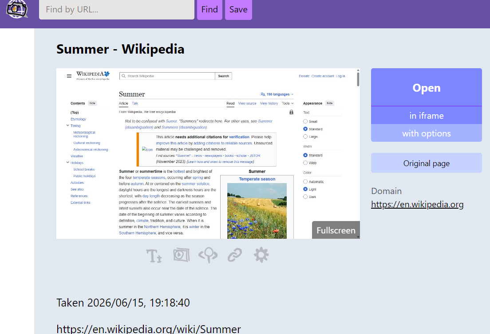
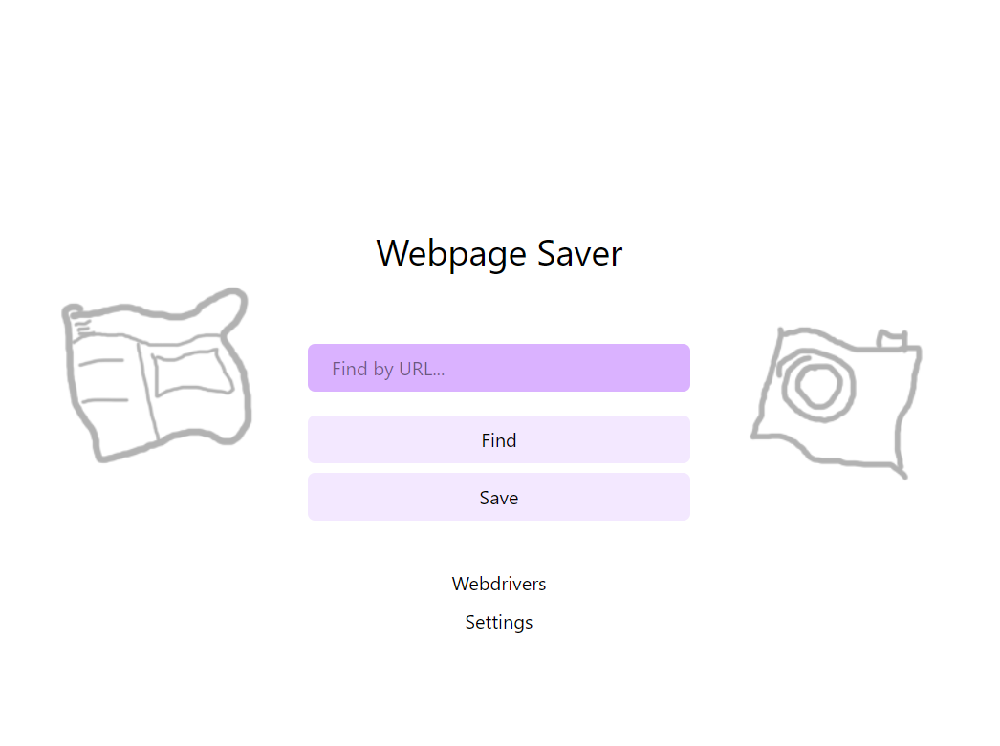

### Webpage Saver

This app allows to save and view pages from the Web locally. 

It uses Playwright and BeatifulSoup4.

But it can artifact sometimes.

#### Documentation

- [How to install](docs/install.md)
- [How to archive pages](docs/pages.md)
- [API](docs/api.md)
- [Webdrivers](docs/webdrivers.md)
- [Extension](docs/dump_html.md)
