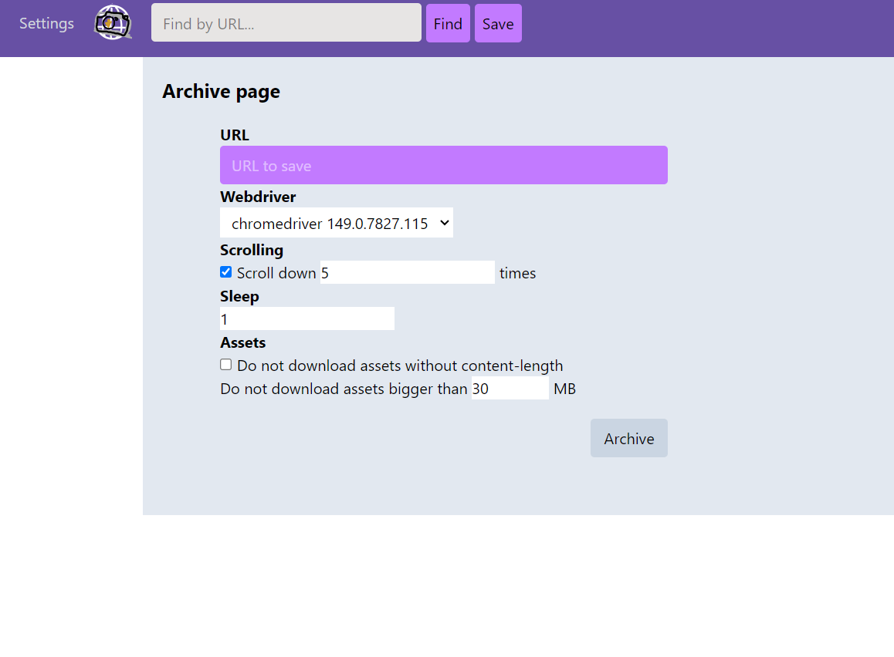
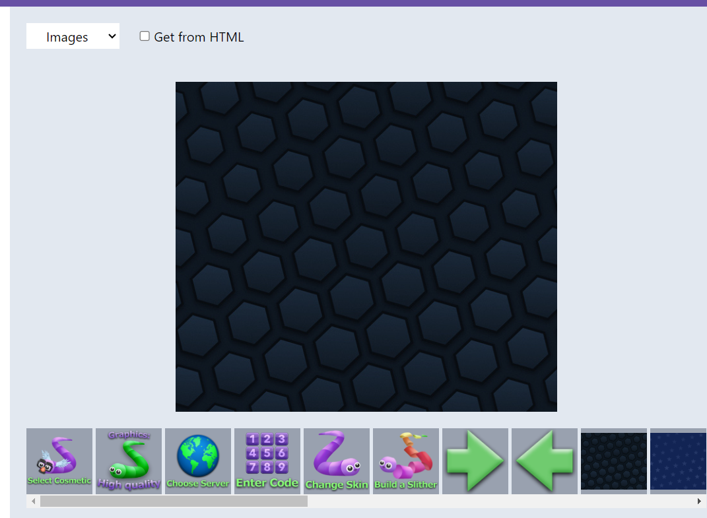

### Saving

You can archive page by pasting a URL to it on `/save` page and clicking to "Archive".

It uses Playwright to save pages. Bc raw html is kinda useless, it uses webdriver to emulate browser. Technically, it's not a webdriver but a headless chrome.

The page is saved in `data/content/webpages` by default to the dir with its ID. It caches into `cache.db` every server start. So, external pages can be added by moving into this folder.

Custom dir with pages can be passed in config param `pages_dir`.

Webpage's dir contains: 

- `index.html` with slightly changed HTML of the original page
- `data.json` with data about page
- `assets` with downloaded assets. 
- `thumbs` with screenshots.

It catches all GET-requests and saves them into `assets`. Their filenames are just a numbers because original encoded URLs can be too long.

On render, original assets in the HTML are replaced with URL to local version. If asset loads from css or its URL was not changed for some reason, it will be catched by Servier Worker.

By default, it will show panel with "About" and "Close" buttons on top right corner of the rendered page.

If you click on link, you will see page with variants - go to the url of the link, archive it or find in Wayback Machine. Also, it will show already saved pages will same url.

If config (conf.json) option `navigation_save` is `1`, it will automatically save this URL and will show archived copy.

If `navigation_first_found` is `1`, it will show first found archived candidate on this URL.

If URL has different domain from the page's domain, it will not save or find anything, if `navigation_another_domains` is not `1`.

It will create two screenshots, first will has viewport sizes, second will be fullscreen.

Also it creates screenshots of the `<canvas>`es because there is no way to save it's content. It will replace them to these images.

It also creates subpages for `<iframe>`s.

`taken` can be changed.

### Also

- In Wayback Machine, every request saves separatly, so you can find it by URL. In this app they are belongs to the page and can't be found via search.

- If page redirected, it will create page with link to page that needed. But only two pages will be saved, so if there is more than two redirects it will not be shown.

- This app saves all detected encodings. If decoding error happened, try to select another or `utf-8`.

- Loaded scripts can break the page, so it's better to turn off them.

- You can specify max size of asset and waiting time before saving.

- [Page can be saved from browser tab via extension.](dump_html.md)

- Page can be deleted, but it will remain in the cache.

- The most sensitive functions are WebPage.getRelativeURL, GotRequest.compare_urls, WebPage.getAssetByUrl.

- Relative URLs can be broken.

### Search

If you write something, it will search in titles of pages. If you write an URL, it will show you calendar with highlighted days of the available archived copies.

### Other

You can view only text from the page, only media or only hyperlinks.

